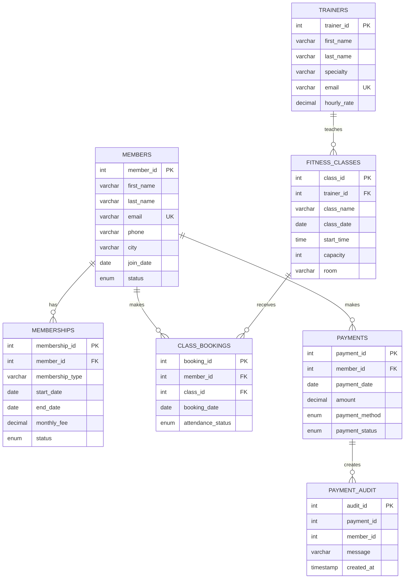

# SQL ER Diagram

## MongoDB document structures

- `workout_logs`: member ID, date, workout type, duration, calories, and an **array** of exercise objects. The array demonstrates semi-structured data and nested documents.
- `member_activity`: member ID, weekly activity measures, goals array, notes, and an **optional** sleep metric. Not every document has the optional field.
- `equipment_logs`: equipment ID, timestamp, usage, temperature, vibration, and status. This represents flexible log/sensor-style records.

### Embedding vs Referencing decision

Exercises are embedded inside `workout_logs` because they belong directly to one workout record and are naturally read together. The SQL side keeps core member/class/payment relationships normalized and connected with foreign keys. MongoDB uses `member_id` as a reference value rather than duplicating the full member record.
